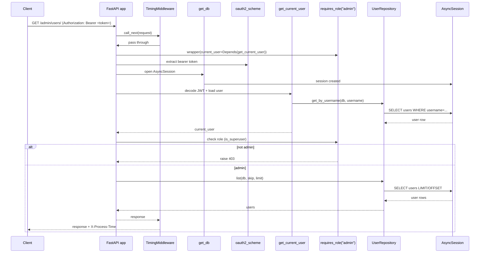

============================
My Understanding of the API 
============================

When you look at more complex FastAPI code like this, it’s really just a set of patterns meant to keep things calm, predictable, and scalable as the app grows. The repository pattern, for example, exists so the rest of the app doesn’t have to care about SQLAlchemy details—it talks to a clean, well-defined API instead. All the common database operations live in one place, and then something like a `UserRepository` can add user-specific queries (such as looking up a user by username) without bloating your route handlers. Using `Generic[T]` in the repository is what makes this approach practical long-term: the same CRUD logic works for any model, stays type-safe, gives you better editor hints, and means fixes or changes happen once instead of being copy-pasted across the codebase.

On the auth side, dependency injection creates a clear, readable chain: one dependency manages the database session, another pulls the bearer token from the request, another validates the JWT and loads the current user, and your endpoints simply declare what they need. Role-based access control builds on that same idea—an `requires_role("admin")` decorator reuses the authenticated user, checks permissions in one consistent place, and raises a 403 when access isn’t allowed. Taken together, these patterns aren’t about being fancy; they’re about separating responsibilities, reducing duplication, making testing easier, and ensuring that changes to authentication, database logic, or permissions don’t ripple unpredictably through the entire codebase.

=================================================
Admin Endpoint Flowchart - As Created by Co-Pilot
=================================================

Request trace for `GET /admin/users/`

Middleware, dependencies, and function calls (ordered)
1) TimingMiddleware wraps the request and measures duration.
2) oauth2_scheme extracts the bearer token from the Authorization header.
3) get_db creates the AsyncSession for DB access.
4) get_current_user decodes JWT, loads User via UserRepository.
5) requires_role("admin") enforces is_superuser.
6) list_users handler calls UserRepository.list.
7) Response returns and TimingMiddleware adds X-Process-Time.

Auth and authorization in this flow
- Authentication: oauth2_scheme + get_current_user validate the token and load the user.
- Authorization: requires_role("admin") checks is_superuser before handler logic runs.

=====================================
Translation Guide (Laymans Terms)
=====================================

asynccontextmanager + lifespan (simple explanation)
- Think of this like opening and closing a shop. When the app starts, you "open up" and set things up. When it shuts down, you "close up" and clean things up.
- The `lifespan` function runs startup code before requests arrive and shutdown code when the app stops.
- It solves the problem of where to safely initialize and close shared resources (like DB connections or cache clients).

TimingMiddleware (what it does + simple example)
- It wraps every request, starts a timer before the route runs, then stops the timer and adds a header with the total time.
- This is useful for quick performance checks without changing your endpoints.

Example idea: if a request takes 23 ms, the response gets a header like:
X-Process-Time: 23

JWT authentication flow (junior-friendly)
- Step 1: User logs in with username/password.
- Step 2: Server checks credentials and gives back a token (JWT).
- Step 3: Client sends that token in the Authorization header for future requests.
- Step 4: Server reads the token, verifies it is valid, and extracts the username.
- Step 5: Server loads the user from the database and allows the request.
- If the token is missing or invalid, the server returns 401.

